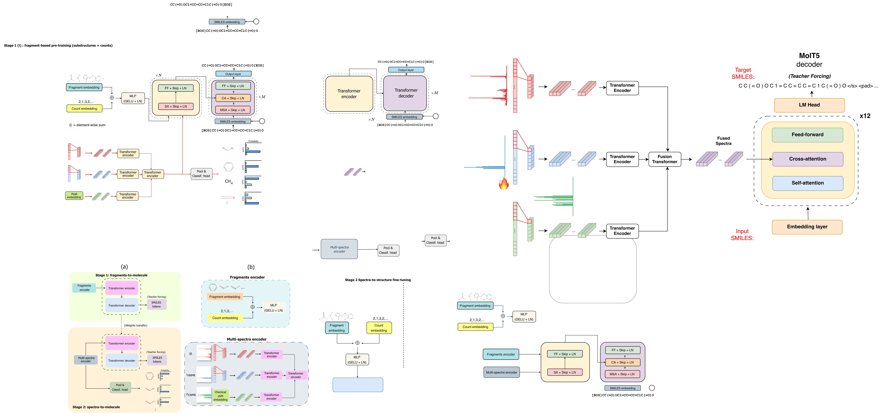

# NMIRacle: Scalable Structure Elucidation from IR and NMR Spectra



**NMIRacle** (NMr-IR orACLE) is a deep learning framework for *de novo* molecular structure elucidation from multi-modal spectroscopic data. The model learns to generate molecular structures (SMILES) directly from raw IR, ¹H-NMR, and ¹³C-NMR spectra through a two-stage training approach that combines fragment-based molecular priors with multi-spectral conditioning.

---

## 🔬 Overview

Molecular structure elucidation from spectroscopy is a fundamental challenge in chemistry. NMIRacle addresses this by:

- **Multi-modal learning**: Integrates IR, ¹H-NMR, and ¹³C-NMR spectra through hierarchical attention mechanisms
- **Fragment-based priors**: Learns count-aware fragment representations that capture both fragment identities and occurrences
- **Two-stage training**: Pre-trains on fragment-to-molecule reconstruction, then fine-tunes with spectral conditioning
- **Minimal pre-processing**: Operates directly on raw spectroscopic intensity arrays

---

## 📦 Data Preparation

### Dataset Structure

NMIRacle expects data in the following structure:

```
datasets/
├── pretrain/                          # Stage 1: Fragment pre-training
│   ├── smiles.npy                     # Molecular SMILES strings
│   ├── substructures_vc.h5            # Fragment count matrices
│   ├── substructure_counts.h5         # Fragment count matrices
│   ├── pretrain_train_indices.npy     # Train split indices
│   ├── pretrain_val_indices.npy       # Validation split indices
│   └── pretrain_test_indices.npy      # Test split indices
│
└── multispectra/                      # Stage 2: Spectra fine-tuning
    ├── smiles.npy                     # Molecular SMILES strings
    ├── spectra.h5                     # Multi-modal spectra (IR, ¹H, ¹³C)
    ├── substructure_counts.h5         # Fragment counts (for multi-task)
    └── split_indices.p                # Train/val/test splits
```

### Spectra Format (HDF5)

The `spectra.h5` contains concatenated (in order):
- `ir`: IR spectra (1,800 features)
- `hnmr`: ¹H-NMR spectra (10,000 features)
- `cnmr`: ¹³C-NMR spectra (10,000 features)
---

## 🎓 Training

### Stage 1: fragment-to-molecule pre-training

Train the model to reconstruct molecules from fragment representations:

```bash
python -m nmiracle.train \
  training_stage=sub2struct \
  data.dataset_name=pretrain_dataset \
  data.batch_size.train=256 \
  trainer.max_epochs=100 \
  logger.wandb.enabled=true
```

### Stage 2: spectra-to-molecule fine-tuning

Fine-tune with spectral conditioning (requires Stage 1 checkpoint):

```bash
python -m nmiracle.train.py \
  training_stage=spec2struct \
  data.dataset_name=alberts_dataset \
  data.use_ir=true \
  data.use_hnmr=true \
  data.use_cnmr=true \
  model.pretrained_structure_model_path=/path/to/stage1/checkpoint.ckpt \
  model.use_multitask=true \
  data.batch_size.train=128 \
  trainer.max_epochs=300 \
  logger.wandb.enabled=true
```

### Resuming training

```bash
python train.py \
  resume.checkpoint_path=/path/to/checkpoint.ckpt \
  trainer.max_epochs=300
```

## 🧪 Inference

### Testing on fragments-to-molecule task

```bash
python -m nmiracle.test_sub2struct \
  --model_path nmiracle/ckpts/sub2struct \
  --checkpoint best.ckpt \
  --temperature 1.0 \
  --top_k 5 \
  --num_sequences 15
```

### Testing on spectra-to-molecule task

```bash
python -m nmiracle.test_spec2struct \
  --model_path nmiracle/ckpts/spec2struct_ir_hnmr_cnmr \
  --checkpoint epoch=295-val_loss=0.15.ckpt \
  --temperature 1.0 \
  --top_k 5 \
  --num_sequences 15
```
---

### Running Evaluation

```bash
# Compute comprehensive metrics
python nmiracle/analysis/compute_metrics.py \
  --predictions_file results/predictions.json \
  --ground_truth_file datasets/alberts/test.json \
  --output_dir results/metrics/
```
---

## 🤝 Citation

If you use NMIRacle in your research, please cite:

```bibtex
@article{nmiracle2025,
  title={NMIRacle: Scalable Structure Elucidation from IR and NMR Spectra},
  author={Your Name et al.},
  journal={arXiv preprint arXiv:XXXX.XXXXX},
  year={2025}
}
```

## 📄 License

This project is licensed under the MIT License - see the [LICENSE](LICENSE) file for details.

---

## 🙏 Acknowledgments

- Built with [PyTorch](https://pytorch.org/) and [PyTorch Lightning](https://lightning.ai/)
- Inspired by [NMR2Struct](https://github.com/MarklandGroup/NMR2Struct) and related work


**⭐ If you find NMIRacle useful, please star the repository!**
