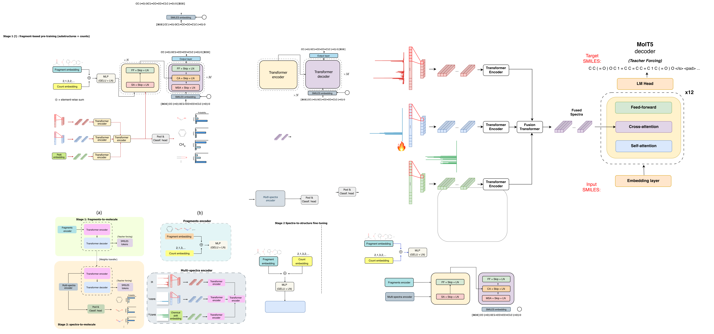

# NMIRacle: Multi-modal Generative Molecular Elucidation from IR and NMR Spectra



---

**NMIRacle** (**NMR-IR oracle**) is a multi-modal generative framework for *de novo* molecular structure elucidation from spectroscopic data. The model learns to generate molecular structures (SMILES) directly from raw IR, ¹H-NMR, and ¹³C-NMR spectra through a two-stage training approach that combines count-aware fragment encodings with multi-spectral conditioning.

## Installation

## 📦 Data Preparation

NMIRacle expects data in the following structure:

```
datasets/
├── pretrain/                          # Stage 1: Fragment pre-training
│   ├── smiles.npy                     # Molecular SMILES strings
│   ├── substructure_counts.h5         # Fragment compositions
│   ├── split_indices.p                # Train/val/test splits
│
└── multispectra/                      # Stage 2: Spectra fine-tuning
    ├── smiles.npy                     # Molecular SMILES strings
    ├── spectra.h5                     # Multi-modal spectra (IR, ¹H, ¹³C)
    ├── substructure_counts.h5         # Fragment compositions
    └── split_indices.p                # Train/val/test splits
```

The `spectra.h5` contains concatenated (in order):
- `ir`: IR spectra (1,800 features)
- `hnmr`: ¹H-NMR spectra (10,000 features)
- `cnmr`: ¹³C-NMR spectra (10,000 features)

Dataset files are going to be released upon publication.

## 🎓 Training

### Stage 1: fragments-to-molecule pre-training

Train the model to reconstruct molecules from count-aware fragment representations:

```bash
python -m nmiracle.train \
  training_stage=sub2struct \
  data/dataset=pretrain_dataset \
  trainer.max_epochs=500 \
  logger.wandb.enabled=true
```

### Stage 2: spectra-to-molecule fine-tuning

Fine-tune with spectral conditioning (requires Stage 1 checkpoint):

```bash
python -m nmiracle.train \
  training_stage=spec2struct \
  data/dataset=multispectra_dataset \
  data.use_ir=true \
  data.use_hnmr=true \
  data.use_cnmr=false \
  model.pretrained_structure_model_path=/path/to/stage1/checkpoint.ckpt \
  trainer.max_epochs=300 \
  logger.wandb.enabled=true
```

## 🧪 Inference

### Testing on fragments-to-molecule task

```bash
python -m nmiracle.test_sub2struct \
  --model_path nmiracle/ckpts/sub2struct \
  --checkpoint best.ckpt \
  --temperature 1.0 \
  --top_k 5 \
  --num_sequences 15
```

### Testing on spectra-to-molecule task

```bash
python -m nmiracle.test_spec2struct \
  --model_path nmiracle/ckpts/spec2struct_ir_hnmr_cnmr \
  --checkpoint epoch=295-val_loss=0.15.ckpt \
  --temperature 1.0 \
  --top_k 5 \
  --num_sequences 15
```

Model checkpoints are going to be released upon publication.

---
